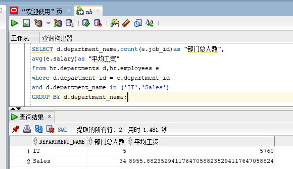
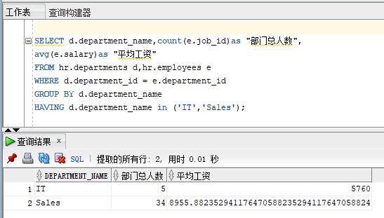
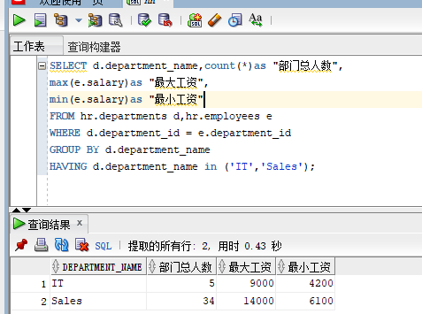

# test1

## 姓名：聂涵 学号：201810414215 班级：18级软件工程2班

## 实验目的

分析SQL执行计划，执行SQL语句的优化指导。理解分析SQL语句的执行计划的重要作用。

## 实验内容

### 查询语句一

~~~sql
set autotrace on

SELECT d.department_name,count(e.job_id)as "部门总人数",
avg(e.salary)as "平均工资"
from hr.departments d,hr.employees e
where d.department_id = e.department_id
and d.department_name in ('IT','Sales')
GROUP BY d.department_name;
~~~

**分析：**

查询内容:部门名(department_name),通过聚合函数count统计工作id数作为"部门总人数",avg计算平均工资

查询表:部门表departments,员工表employees

查询条件:部门表department_id = 员工表的department_id ,部门表depatment_name在('IT','Sales')中,通过部门表的department_name进行分组

### 查询语句二

~~~sql
set autotrace on

SELECT d.department_name,count(e.job_id)as "部门总人数",
avg(e.salary)as "平均工资"
FROM hr.departments d,hr.employees e
WHERE d.department_id = e.department_id
GROUP BY d.department_name
HAVING d.department_name in ('IT','Sales');
~~~

**分析：**

查询内容:部门名(department_name),通过聚合函数count统计工作id数作为"部门总人数",avg计算平均工资

查询表:部门表departments,员工表employees

查询条件:部门表department_id = 员工表的department_id ,对部门表进行分！组,使用HAVING对分组的结果集进行筛选，部门名必须为'IT'或'Sales'

>**sql优化指导结果**:There are no recommendations to improve the statement.

### 设计Sql语句

~~~sql
SELECT d.department_name,count(*)as "部门总人数",
max(e.salary)as "最大工资",
min(e.salary)as "最小工资"
FROM hr.departments d,hr.employees e
WHERE d.department_id = e.department_id
GROUP BY d.department_name
HAVING d.department_name in ('IT','Sales');
~~~

**分析：**

查询内容:部门名(department_name),通过聚合函数count统计"部门总人数",max查找工资,min查找最小工资

查询表:部门表departments,员工表employees

查询条件:部门表department_id = 员工表的department_id ,对部门表进行分！组,使用HAVING对分组的结果集进行筛选，部门名必须为'IT'或'Sales'

