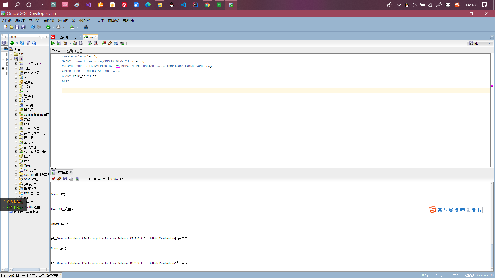
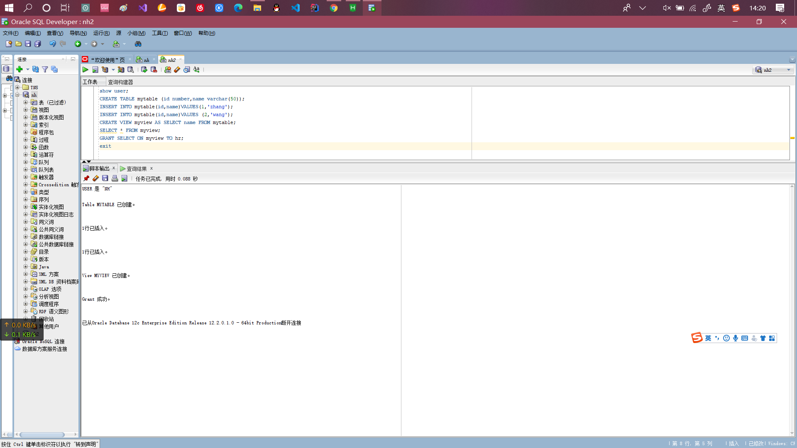
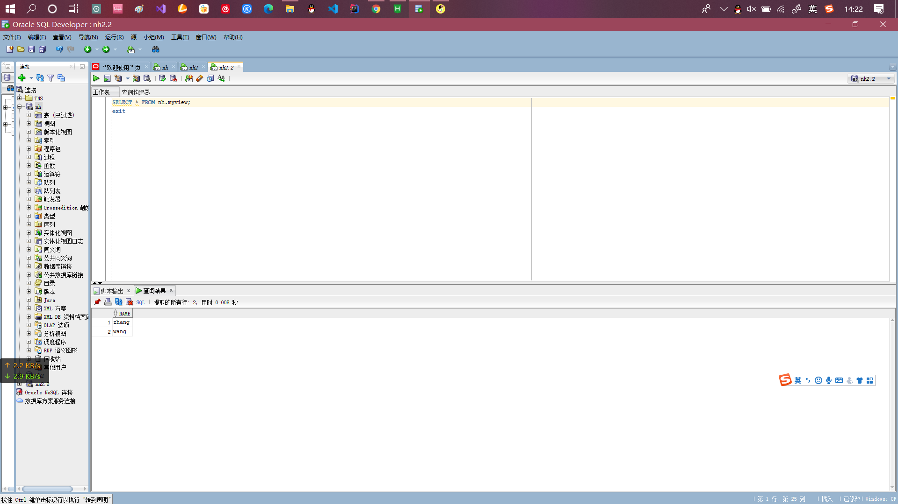
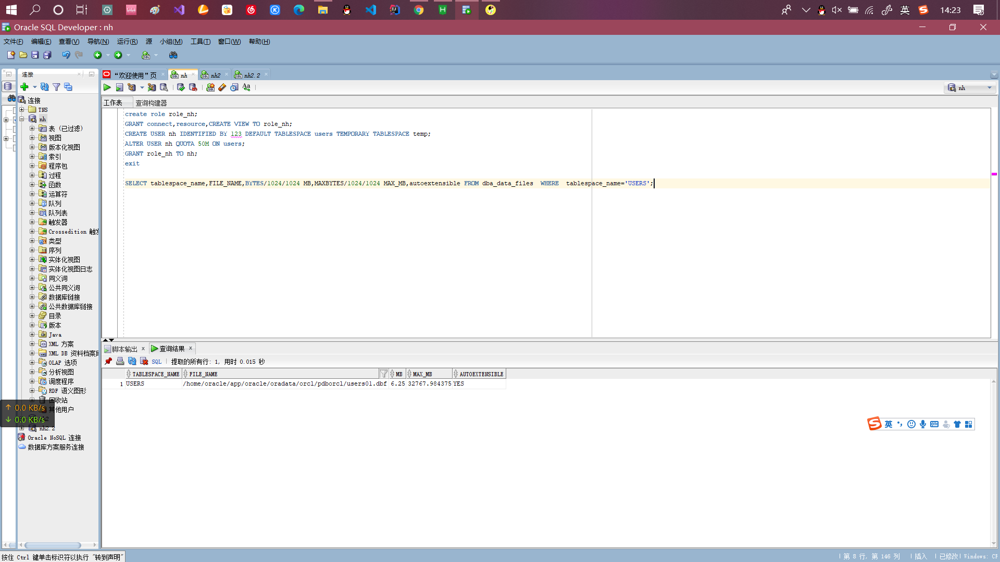
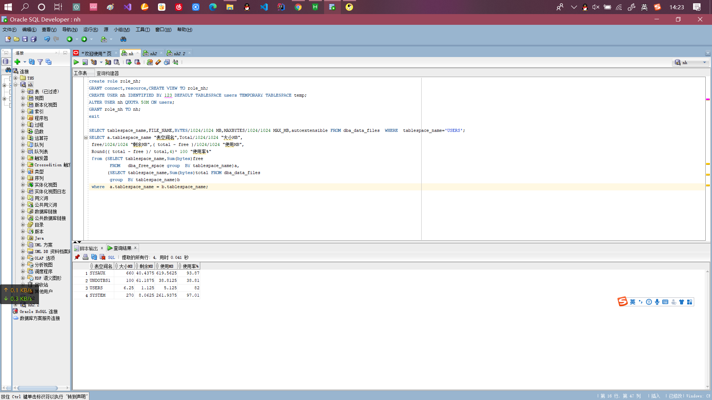

# 实验目的
掌握用户管理、角色管理、权根维护与分配的能力，掌握用户之间共享对象的操作技能。
# 实验内容
Oracle有一个开发者角色resource，可以创建表、过程、触发器等对象，但是不能创建视图。本训练要求：
- 在pdborcl插接式数据中创建一个新的本地角色role_nh，该角色包含connect和resource角色，同时也包含CREATE VIEW权限，这样任何拥有role_nh的用户就同时拥有这三种权限。
- 创建角色之后，再创建用户nh，给用户分配表空间，设置限额为50M，授予role_nh角色。
- 最后测试：用新用户nh连接数据库、创建表，插入数据，创建视图，查询表和视图的数据。
# 实验步骤
- 第1步：以system登录到pdborcl，创建角色role_nh和用户nh，并授权和分配空间：
~~~sql
create role role_nh;
GRANT connect,resource,CREATE VIEW TO role_nh;
CREATE USER nh IDENTIFIED BY 123 DEFAULT TABLESPACE users TEMPORARY TABLESPACE temp;
ALTER USER nh QUOTA 50M ON users;
GRANT role_nh TO nh;
exit
~~~
**实验截图*

- 第2步：新用户nh连接到pdborcl，创建表mytable和视图myview，插入数据，最后将myview的SELECT对象权限授予hr用户。
~~~sql
show user;
CREATE TABLE mytable (id number,name varchar(50));
INSERT INTO mytable(id,name)VALUES(1,'zhang');
INSERT INTO mytable(id,name)VALUES (2,'wang');
CREATE VIEW myview AS SELECT name FROM mytable;
SELECT * FROM myview;
GRANT SELECT ON myview TO hr;
exit
~~~
**实验截图*

- 第3步：用户hr连接到pdborcl，查询nh授予它的视图myview
~~~sql
SELECT * FROM nh.myview;
exit
~~~
**实验截图*

# 查看数据库的使用情况
查看表空间的数据库文件，以及每个文件的磁盘占用情况。
~~~sql
SELECT tablespace_name,FILE_NAME,BYTES/1024/1024 MB,MAXBYTES/1024/1024 MAX_MB,autoextensible FROM dba_data_files  WHERE  tablespace_name='USERS';
SELECT a.tablespace_name "表空间名",Total/1024/1024 "大小MB",
 free/1024/1024 "剩余MB",( total - free )/1024/1024 "使用MB",
 Round(( total - free )/ total,4)* 100 "使用率%"
 from (SELECT tablespace_name,Sum(bytes)free
        FROM   dba_free_space group  BY tablespace_name)a,
       (SELECT tablespace_name,Sum(bytes)total FROM dba_data_files
        group  BY tablespace_name)b
 where  a.tablespace_name = b.tablespace_name;
~~~
**实验截图*


# 实验总结
```txt
通过本次实验，我学会了Orcale的怎么创建一个用户和角色，学会了用户与角色间的权限维护和分配，还学习了用户之间共享对象的操作技能。
```