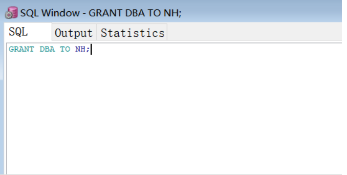
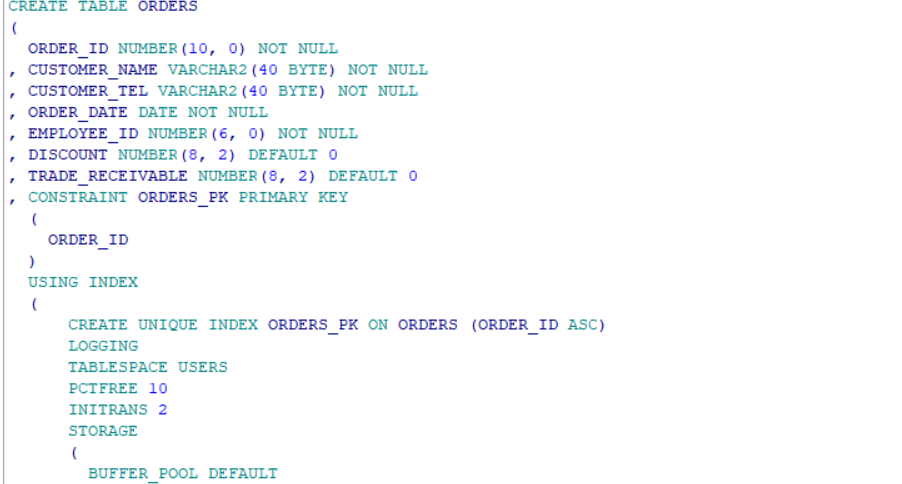
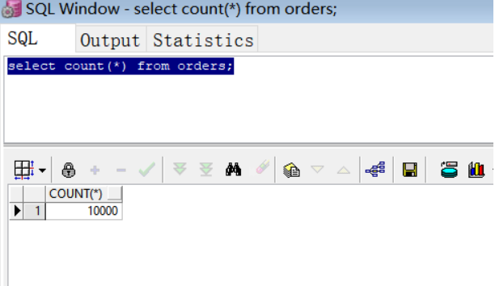
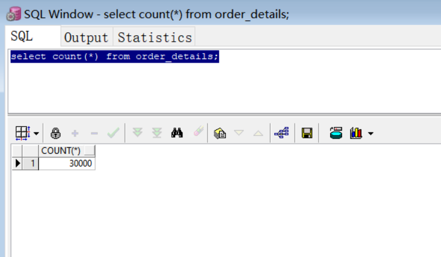
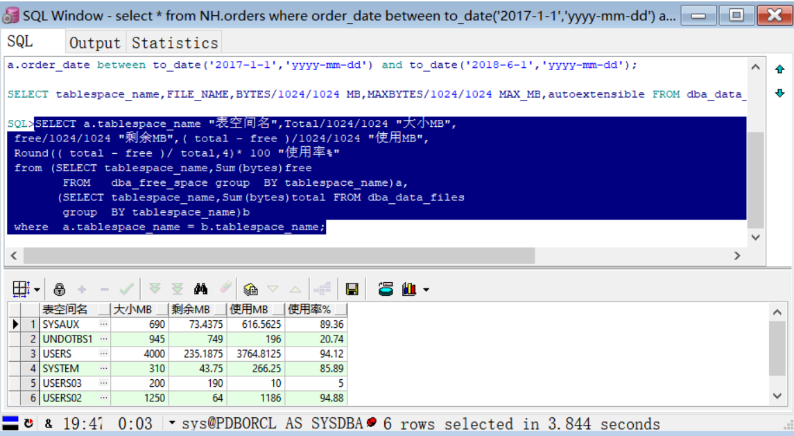

# 实验目的

掌握分区表的创建方法，掌握各种分区方式的使用场景。

# 实验内容


- 本实验使用3个表空间：USERS,USERS02,USERS03。在表空间中创建两张表：订单表(orders)与订单详表(order_details)。
- 使用**你自己的账号创建本实验的表**，表创建在上述3个分区，自定义分区策略。
- 你需要使用system用户给你自己的账号分配上述分区的使用权限。你需要使用system用户给你的用户分配可以查询执行计划的权限。
- 表创建成功后，插入数据，数据能并平均分布到各个分区。每个表的数据都应该大于1万行，对表进行联合查询。
- 写出插入数据的语句和查询数据的语句，并分析语句的执行计划。
- 进行分区与不分区的对比实验。

# 创建表空间users02：

CREATE TABLESPACE users02 DATAFILE
'/home/student/nh/pdbtest_users02_1.dbf'
  SIZE 100M AUTOEXTEND ON NEXT 50M MAXSIZnhE UNLIMITED，
'/home/student/nh/pdbtest_users02_2.dbf' 
  SIZE 100M AUTOEXTEND ON NEXT 50M MAXSIZE UNLIMITED
EXTENT MANAGEMENT LOCAL SEGMENT SPACE MANAGEMENT AUTO;

# 权限



# 创建表orders

~~~sql
CREATE TABLE ORDERS
(
  ORDER_ID NUMBER(10, 0) NOT NULL
, CUSTOMER_NAME VARCHAR2(40 BYTE) NOT NULL
, CUSTOMER_TEL VARCHAR2(40 BYTE) NOT NULL
, ORDER_DATE DATE NOT NULL
, EMPLOYEE_ID NUMBER(6, 0) NOT NULL
, DISCOUNT NUMBER(8, 2) DEFAULT 0
, TRADE_RECEIVABLE NUMBER(8, 2) DEFAULT 0
, CONSTRAINT ORDERS_PK PRIMARY KEY
  (
    ORDER_ID
  )
  USING INDEX
  (
      CREATE UNIQUE INDEX ORDERS_PK ON ORDERS (ORDER_ID ASC)
      LOGGING
      TABLESPACE USERS
      PCTFREE 10
      INITRANS 2
      STORAGE
      (
        BUFFER_POOL DEFAULT
      )
      NOPARALLEL
  )
  ENABLE
)
TABLESPACE USERS
PCTFREE 10
INITRANS 1
STORAGE
(
  BUFFER_POOL DEFAULT
)
NOCOMPRESS
NOPARALLEL
PARTITION BY RANGE (ORDER_DATE)
(
  PARTITION PARTITION_2015 VALUES LESS THAN (TO_DATE(' 2016-01-01 00:00:00', 'SYYYY-MM-DD HH24:MI:SS', 'NLS_CALENDAR=GREGORIAN'))
  NOLOGGING
  TABLESPACE USERS
  PCTFREE 10
  INITRANS 1
  STORAGE
  (
    INITIAL 8388608
    NEXT 1048576
    MINEXTENTS 1
    MAXEXTENTS UNLIMITED
    BUFFER_POOL DEFAULT
  )
  NOCOMPRESS NO INMEMORY
, PARTITION PARTITION_2016 VALUES LESS THAN (TO_DATE(' 2017-01-01 00:00:00', 'SYYYY-MM-DD HH24:MI:SS', 'NLS_CALENDAR=GREGORIAN'))
  NOLOGGING
  TABLESPACE USERS
  PCTFREE 10
  INITRANS 1
  STORAGE
  (
    BUFFER_POOL DEFAULT
  )
  NOCOMPRESS NO INMEMORY
, PARTITION PARTITION_2017 VALUES LESS THAN (TO_DATE(' 2018-01-01 00:00:00', 'SYYYY-MM-DD HH24:MI:SS', 'NLS_CALENDAR=GREGORIAN'))
  NOLOGGING
  TABLESPACE USERS
  PCTFREE 10
  INITRANS 1
  STORAGE
  (
    BUFFER_POOL DEFAULT
  )
  NOCOMPRESS NO INMEMORY
, PARTITION PARTITION_2018 VALUES LESS THAN (TO_DATE(' 2019-01-01 00:00:00', 'SYYYY-MM-DD HH24:MI:SS', 'NLS_CALENDAR=GREGORIAN'))
  NOLOGGING
  TABLESPACE USERS02
  PCTFREE 10
  INITRANS 1
  STORAGE
  (
    BUFFER_POOL DEFAULT
  )
  NOCOMPRESS NO INMEMORY
, PARTITION PARTITION_2019 VALUES LESS THAN (TO_DATE(' 2020-01-01 00:00:00', 'SYYYY-MM-DD HH24:MI:SS', 'NLS_CALENDAR=GREGORIAN'))
  NOLOGGING
  TABLESPACE USERS02
  PCTFREE 10
  INITRANS 1
  STORAGE
  (
    BUFFER_POOL DEFAULT
  )
  NOCOMPRESS NO INMEMORY
, PARTITION PARTITION_2020 VALUES LESS THAN (TO_DATE(' 2021-01-01 00:00:00', 'SYYYY-MM-DD HH24:MI:SS', 'NLS_CALENDAR=GREGORIAN'))
  NOLOGGING
  TABLESPACE USERS02
  PCTFREE 10
  INITRANS 1
  STORAGE
  (
    BUFFER_POOL DEFAULT
  )
  NOCOMPRESS NO INMEMORY
, PARTITION PARTITION_2021 VALUES LESS THAN (TO_DATE(' 2022-01-01 00:00:00', 'SYYYY-MM-DD HH24:MI:SS', 'NLS_CALENDAR=GREGORIAN'))
  NOLOGGING
  TABLESPACE USERS03
  PCTFREE 10
  INITRANS 1
  STORAGE
  (
    BUFFER_POOL DEFAULT
  )
  NOCOMPRESS NO INMEMORY
);
~~~





# 创建表order_details

```sql
SQL> CREATE TABLE order_details 
(
id NUMBER(10, 0) NOT NULL 
, order_id NUMBER(10, 0) NOT NULL
, product_id VARCHAR2(40 BYTE) NOT NULL 
, product_num NUMBER(8, 2) NOT NULL 
, product_price NUMBER(8, 2) NOT NULL 
, CONSTRAINT order_details_fk1 FOREIGN KEY  (order_id)
REFERENCES orders  (  order_id   )
ENABLE 
) 
TABLESPACE USERS 
PCTFREE 10 INITRANS 1 
STORAGE (   BUFFER_POOL DEFAULT ) 
NOCOMPRESS NOPARALLEL
PARTITION BY REFERENCE (order_details_fk1)
(
PARTITION PARTITION_BEFORE_2016 
NOLOGGING 
TABLESPACE USERS --必须指定表空间,否则会将分区存储在用户的默认表空间中
...
) 
NOCOMPRESS NO INMEMORY, 
PARTITION PARTITION_BEFORE_2017 
NOLOGGING 
TABLESPACE USERS02
...
) 
NOCOMPRESS NO INMEMORY  
);
```



##  查看数据库的使用情况



# 实验总结

​	通过本次实验，我基本掌握了分区表的创建方法，掌握了各种分区方式的使用场景。