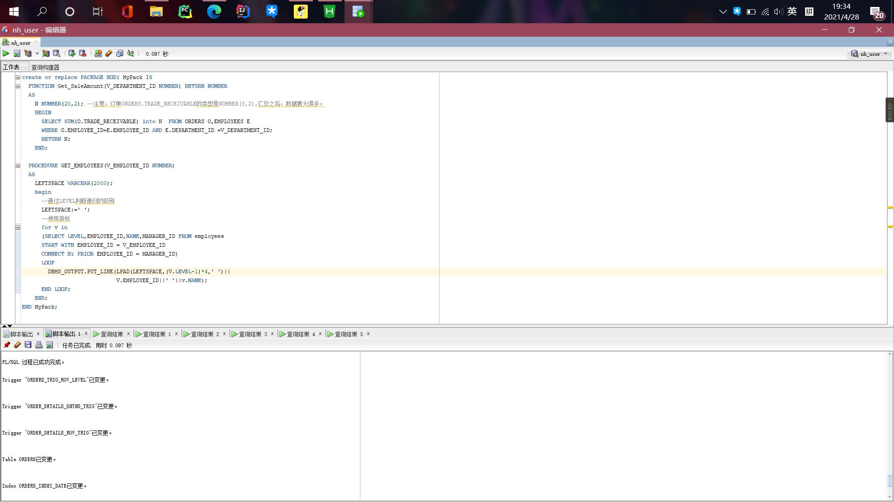

## 姓名：聂涵 学号：201810414215 班级：18级软件工程2班    
## 实验目的
1. 了解PL/SQL语言结构
2. 了解PL/SQL变量和常量的声明和使用方法
3. 学习条件语句的使用方法
4. 学习分支语句的使用方法
5. 学习循环语句的使用方法
6. 学习常用的PL/SQL函数
7. 学习包，过程，函数的用法。
## 实验场景
- 假设有一个生产某个产品的单位，单位接受网上订单进行产品的销售。通过实验模拟这个单位的部分信息：员工表，部门表，订单表，订单详单表。
- 本实验以实验四为基础

## 实验内容以及实验步骤
1. 创建一个包(Package)，包名是MyPack。
~~~sql
create or replace PACKAGE MyPack IS
  FUNCTION Get_SaleAmount(V_DEPARTMENT_ID NUMBER) RETURN NUMBER;
  PROCEDURE Get_Employees(V_EMPLOYEE_ID NUMBER);
END MyPack;
~~~

2. 创建BODY
~~~sql
create or replace PACKAGE BODY MyPack IS
  FUNCTION Get_SaleAmount(V_DEPARTMENT_ID NUMBER) RETURN NUMBER
  AS
    N NUMBER(20,2); --注意，订单ORDERS.TRADE_RECEIVABLE的类型是NUMBER(8,2),汇总之后，数据要大得多。
    BEGIN
      SELECT SUM(O.TRADE_RECEIVABLE) into N  FROM ORDERS O,EMPLOYEES E
      WHERE O.EMPLOYEE_ID=E.EMPLOYEE_ID AND E.DEPARTMENT_ID =V_DEPARTMENT_ID;
      RETURN N;
    END;

  PROCEDURE GET_EMPLOYEES(V_EMPLOYEE_ID NUMBER)
  AS
    LEFTSPACE VARCHAR(2000);
    begin
      --通过LEVEL判断递归的级别
      LEFTSPACE:=' ';
      --使用游标
      for v in
      (SELECT LEVEL,EMPLOYEE_ID,NAME,MANAGER_ID FROM employees
      START WITH EMPLOYEE_ID = V_EMPLOYEE_ID
      CONNECT BY PRIOR EMPLOYEE_ID = MANAGER_ID)
      LOOP
        DBMS_OUTPUT.PUT_LINE(LPAD(LEFTSPACE,(V.LEVEL-1)*4,' ')||
                             V.EMPLOYEE_ID||' '||v.NAME);
      END LOOP;
    END;
END MyPack;
~~~

>函数Get_SaleAmount()测试方法
~~~sql
select count(*) from orders;
select MyPack.Get_SaleAmount(11) AS 部门11应收金额,MyPack.Get_SaleAmount(12) AS 部门12应收金额 from dual;
~~~

>过程Get_Employees()测试代码
~~~sql
set serveroutput on
DECLARE
  V_EMPLOYEE_ID NUMBER;    
BEGIN
  V_EMPLOYEE_ID := 1;
  MYPACK.Get_Employees (  V_EMPLOYEE_ID => V_EMPLOYEE_ID) ;  
  V_EMPLOYEE_ID := 11;
  MYPACK.Get_Employees (  V_EMPLOYEE_ID => V_EMPLOYEE_ID) ;    
END;
~~~
